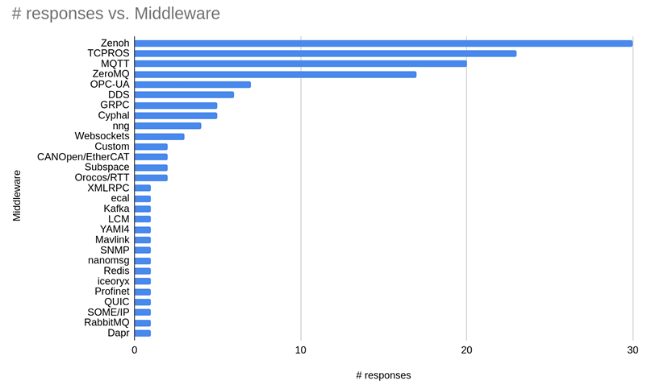
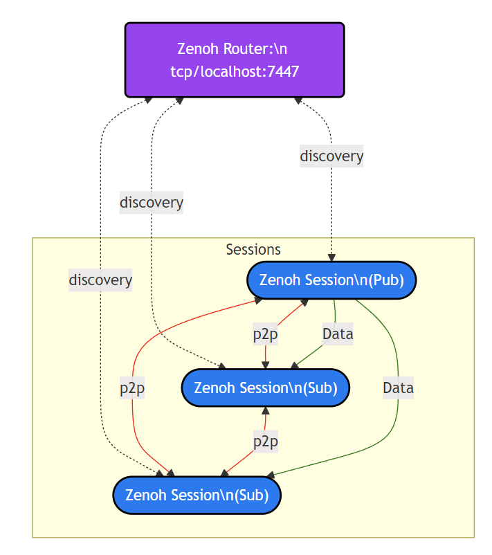
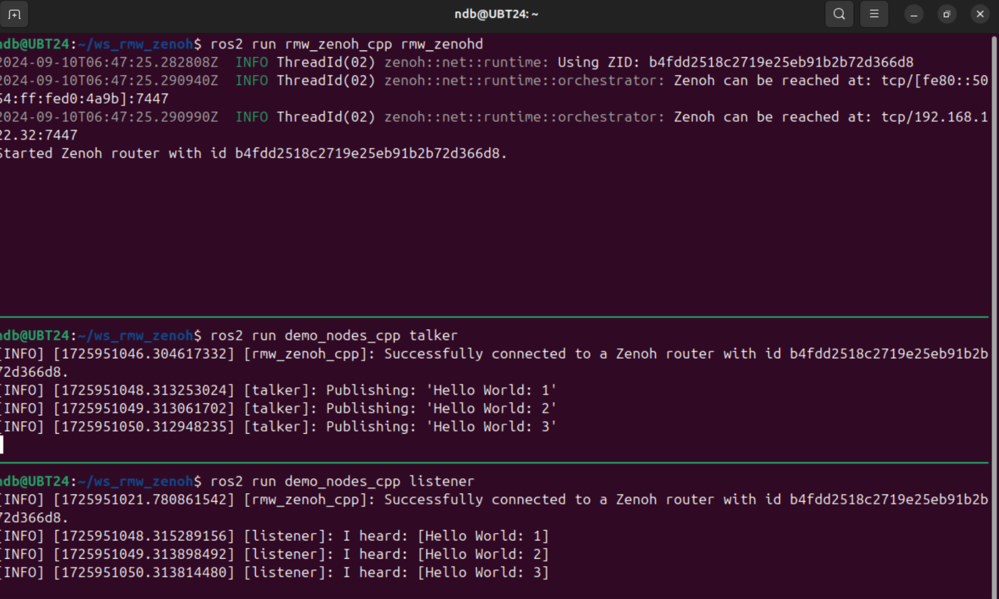

# DDS 与 Zenoh 的区别

本文旨在简要介绍 ROS 2 中的中间件接口的设计思路、为何选用又弃用 DDS、以及为何选用 Zenoh 作为新的中间件方案。

## Refs
1. [Ros 2 设计文档 —— ros 的中间件接口](https://design.ros2.org/articles/ros_middleware_interface.html)
2. [Ros 2 设计文档 —— 在 DDS 上的 ROS](https://design.ros2.org/articles/ros_on_dds.html)
3. [Ros 2 更换中间件报告](https://discourse.ros.org/t/ros-2-alternative-middleware-report/33771)
4. [ros2 zenoh 中间件设计简介](https://github.com/ros2/rmw_zenoh/blob/rolling/docs/design.md)

## 详细介绍

### ROS 的中间件接口设计

> 详细实现可参见参考资料中的 [Ros 2 设计文档 —— ros 的中间件接口](https://design.ros2.org/articles/ros_middleware_interface.html)

ROS 的客户端库向用户开放一组通信 API，其中包含诸如发布/订阅（Pub/Sub）这样的通信概念，而这些通信概念的实现在 ROS 1 中是建立在自定义协议上的。

然而在构建 ROS 2 时，为了避免从零开始或从头构建中间件，希望能够使用一些拥有完善的标准与实现的端到端中间件，在社区经过调研之后，最终选择在如今的 DDS 上进行 ROS 2 通信系统的构建。

在中间件接口设计的过程中，尽管 ROS 2 的设计目标是仅支持基于 DDS 的实现方案，但该中间件接口设计中同样尽量保证不向 ROS 用户暴露任何特定的 DDS 实现细节，以便支持 ROS 2 可使用不同的中间件实现。

```
+-----------------------------------+
|             user land             |   no middleware implementation specific code
+-----------------------------------+
|        ROS client library         |   above the interface
+-----------------------------------+
|       middleware interface        |   ---
+-----------------------------------+
| mw impl 1 | mw impl 2 | mw impl 3 |
+-----------+-----------+-----------+
```

具体来说，ROS 为了能够兼容不同的 DDS 实现，通过设计统一的中间件接口（middleware interface）来定义一组 ROS 客户端库和任何特定 DDS 实现之间的 API。这通常是由一个轻量的适配器（thin adapter）将通用的中间件接口（generic middleware interface）映射到特定中间件（如 DDS）的 API 上（specific API of the middleware implementation）。

```
+-----------------------------------------------+
|                   user land                   |
+-----------------------------------------------+
|              ROS client library               |
+-----------------------------------------------+
|             middleware interface              |
+-----------------------------------------------+
| DDS adapter 1 | DDS adapter 2 | DDS adapter 3 |
+---------------+---------------+---------------+
|    DDS impl 1 |    DDS impl 2 |    DDS impl 3 |
+---------------+---------------+---------------+
```

### ROS2 为什么选择 DDS

> 什么是 DDS？DDS 如何被选择，又如何具体在 ROS 2 中实现的详细内容可参考该文档 [Ros 2 设计文档 —— 在 DDS 上的 ROS](https://design.ros2.org/articles/ros_on_dds.html)

简要来说，DDS 在 ROS 2 中被选择主要是出于以下考量：
#### 满足需求
1. DDS 提供的发布-订阅传输与 ROS 的发布-订阅传输非常相似；
2. DDS 提供的默认发现系统（discovery system）是一个分布式发现系统，这使得任意两个 DDS 程序之间可以不借助ROS 主控之类的工具进行通信，使得系统更具容错性和灵活性；
3. DDS 具有一个活跃且持续迭代的规范标准，正在不断发展以满足用户的需求；
#### 具有技术可信度
4. DDS 已广泛应用于战舰、金融系统、飞行系统等关键任务，具有可靠性；
5. DDS 的线传输规范（DDSI-RTPS）极具灵活性，允许其用于可靠的高级系统集成以及嵌入式设备上的实时应用，但这种灵活性是以复杂性为代价的；
#### 供应商和许可
6. OMG 与几家公司一起定义了 DDS 规范，有一系列具有不同策略和许可证的参考实现，有望使 ROS 2 对 DDS 供应商保持独立；
#### 理念与社区
7. DDS 来自于一组拥有几十年历史的公司，由老派的软件工程组织 OMG 制定，主要被政府和军事用户使用，DDS 并没有感觉有一个庞大的社区可以依靠。

最终，DDS 被选用为 ROS 2 的 Tier 1 中间件支持方案，在过去八年间为 ROS 2 的用户提供服务。

### DDS 的缺陷与 Zenoh 的优势

> 该部分内容来源自 [Ros 2 更换中间件报告](https://discourse.ros.org/t/ros-2-alternative-middleware-report/33771)，其中每一项都包含更详细的介绍，限于篇幅仅进行有选择的翻译，若对某项具体内容感兴趣可参照资料

#### DDS 的缺陷
ROS 2 中间件（ROS MiddleWare，RMW）接口选用 DDS 作为最优先的底层通讯机制，的确满足许多设计之初的需求。然而在过去八年间的使用中，用户也反映了该方案存在的问题：

1. RMW 接口的设计本应是一套通用方案，然而目前所有最优先（Tier 1）实现都基于 DDS，这可能会导致 DDS 的实现细节通过该接口泄露；
2. DDS 需保持成员节点的全连接图（fully-connected graph of participants），这限制了系统中网络实体的数量；
3. DDS 的发现机制（Discovery）默认依赖于多点传播（multicast） UDP，然而许多部署环境并不支持多点传播 UDP 或限制了可访问的网络范围，导致静默发现（silent discovery）的失效。尽管独立机器人通常使用单个 LAN，但仍有许多机器人领域需要更多扩展空间；
4. DDS 难以处理许多机器人软件系统所必需的大型讯息，例如图像、点云等； 
5. DDS 在 WIFI 网络下难以使用，尤其是 UDP 多点传播被禁用或网络链接不稳定的情况下。对许多需要在 WIFI 环境下应用的机器人领域而言这是一个痛点；
6. DDS 在非理想网络环境下的配置过于复杂。

这些问题或多或少可以通过对 DDS 进行专门配置或使用供应商对 DDS 标准的特定拓展来解决。然而 ROS 用户社区中许多人认为，一个在大多数机器人应用中“可用”而忽略一些边界情况的备选中间件实现也是有必要的。

因此，社区的目标是：**在保留 DDS 来满足那些要求严苛的应用的同时，来改善系统在满足基本需求前提下“开箱即用”的体验。**

#### 需求征集

ROS 2 核心团队征集了用户对 ROS 2 传输与中间件的需求列表。这些需求主要来源自：ROS 2 的已知用例、对 ROS 2 社区主要利益相关者的针对性访谈，以及向整个 ROS 2 社区发送的用户调查

其中关于用户调查包含一个自定义项用于推荐应被参考调研的中间件选项，其中 Zenoh 是被最多用户所推荐的。




#### 需求列表
最终社区得出一份需求清单，使用 RFC 2119 中的术语 “必须”（Must）、“应该”（Should）以及“可以”（May）来进行分类。

|  需求   | 级别  | 备注 |
|  ----  | ----  | --- |
| Pub/Sub  | 必须 | 预期中为了性能，点对点通信是必要的，但也有其他选择。（例如，作为替代方案，可以在每个主机上安装一个 MQTTrouter，并在每个主机内安装共享内存） |
| Security - Encryption| 必须| 例如：TLS |
| Security - Authentication| 必须 | 例如，对等方（Peers）在连接期间使用由某些应用特定的证书颁发机构生成的证书。 |
| Security - Access Control | 必须 | 确切定义可能有所不同，但需求是可以针对每个身份进行比全局允许/拒绝更细粒度的访问控制。例如，身份 A 可能在主题 B 上发布，但不能在主题 C 上发布 |
| Gracefully handle disconnect/reconnect of the network | 必须 | WiFi。重新建立连接时需要平稳、快速地恢复发布/订阅/服务 |
| Tolerance to bandwidth changes | 必须 | WiFi连接可以按数量级（order(s) of magnitude）动态地改变带宽 |
| Configure which interface to use| 必须 | 许多场景需要使用特定的网络接口（虚拟网络、路由） |
| Ability to send multi-megabyte messages | 必须 | 需要发送图像、点云等，对于“重型”传感器来说，通常< 30Hz，并且具有合理的 CPU 使用率，尤其是在有损网络上 |
| Ability to send fast small messages| 必须 | 来自实时子系统的机器人状态更新，例如 1kHz，<1kB 的消息 |
| Restart discovery without restarting all nodes | 必须 | 对于极端需求安全的场景，单点故障不能需要完整的重启 |
| Cross Platform support | 必须 | 中间件必须支持 ROS2 的 Tier1 目标平台：Ubuntu Linux amd64 和 arm64，以及 Windows |
| OSI approved permissive license | 必须 | 中间件必须使用 OSI 批准的许可证，并且许可证必须是宽容的（permissive 而非 copyleft-style） |
| Built-inDiscovery | 应该 | 如果有足够的钩子（hooks）允许这样做，发现（Discovery）系统可以内置于或位于 pub/sub 中间件之外 |
| Routing across subnets | 应该 | 机器人通常有机载子网（subnets onboard robots），以及为调试或繁重处理使用的机外子网（offboard subnets）。如果某个候选实现方案不满足该需求，那么需要一些额外的方案来提供该项能力（如 TCP 流） |
| Shared memory (intra-host) | 应该 | 一些常见的机器人发布/订阅需求（如相机图像、点云）是千兆位每秒以上，并且随着 USB3 和 10G 传感器的重度使用，传感器带宽要求不断增长 |
| Peer-to-peer data connections | 应该 | 类代理（brokered-like）的网络往往会增加所需的网络带宽，同时增加延迟 |
| RPC | 可以 | 如果候选中间件没有内置异步 RPC，则需要找到另一种解决方案来实现它 |
| Protocol debugging tooling (CLI, GUI, Wireshark plugins, etc) | 可以 | 调试网络协议的能力 |
| Prioritization of message streams (small high-priority messages can interrupt large lower-priority messages) | 可以 | 希望当带宽不足以处理所有数据时，可以传递某些更为重要的数据流（例如，操纵杆遥控命令） |
| Control over reliability QoS | 可以 | 在某些场景下（例如传感器），获取最新消息比获取所有消息更重要 |
| Control over QoS history | 可以 | 需要妥善配置如何处理速度慢的订阅者或速度慢的网络 |
| Control for "latching" | 可以 | ROS2 graphs 中通常有较晚加入的订阅者（subscribers），因此需要某种方式让发布者“记住”过去的数据并将其传递给它们。 |
| Ability to configure static peers  | 可以 | 在大型网络中，可能只想与某些对等方（Peers）之间彼此发现 |

#### 为何选择 Zenoh

社区对于挑选出的候选中间件实现进行了综合评估，来进行逐项的需求匹配。

各候选中间件的匹配情况可见[该表格](https://docs.google.com/spreadsheets/d/18SgD-aFJAiDus5cYMN-ya9greOgXq-ErVEsWuV40Kjw/edit#gid=1189402529) 

该表格的一些核心结论如下：

+ Zenoh 满足大多数需求。对于那些尚未满足的需求，要么相应功能正在被开发，要么可以继续现有功能构建；
+ TCPROS 是 ROS 1 中的底层通信机制。它专为机器人应用程序的需求而设计，因此它也满足大多数当前要求；
+ MQTT 在物联网领域被广泛使用，同样满足众多需求。然而它对消息（messages）存在尺寸限制，且需 MQTT 代理充当通讯中介，与 ROS 的需求并不那么适配；
+ ZeroMQ（及其延申，nng）满足许多需求，并在 Gazebo 中活跃使用。但由于 ZeroMQ 更像是一个网络原语“工具箱”，后续需要大量的额外开发工作才能创建功能齐全的中间件；
+ OPC-UA 满足多项需求，但它是代理架构，且默认没有发现（Discovery）功能；
+ DDS 是目前 ROS 2 使用的代理框架，它满足许多需求但缺陷正如前所述；
+ Kafka 是一种有趣且广泛使用的消息服务，但它相当复杂，且消息传递模型不能直接映射到 ROS。

社区也搜集了第三方对部分中间件进行的详细性能评估：

+ [Zenoh vs MQTT vs Kafka vs DDS](https://zenoh.io/blog/2023-03-21-zenoh-vs-mqtt-kafka-dds/)
+ [Fast-DDS vs CycloneDDS](https://eprosima.com/index.php/resources-all/performance/fast-dds-vs-cyclone-dds-performance)
+ [Fast-DDS vs ZeroMQ](https://eprosima.com/index.php/resources-all/performance/zmq-vs-eprosima-fast-rtps)
+ [Kafka vs ActiveMQ vs RabbitMQ](https://digitalscholarship.unlv.edu/cgi/viewcontent.cgi?article=4749&context=thesesdissertations)

最终，Zenoh 被认为最符合要求，它同样也是用户最推荐的替代方案。它可以被视为 TCPROS 的一种现代实现，并且能够满足大多数 ROS 2 要求，因此被选为替代中间件。
 

### Zenoh 的设计与简易使用
> 详细内容可见 [rmw_zenoh repo](https://github.com/ros2/rmw_zenoh) 中的项目文档

在 ROS2 Jazzy 版本发布时，社区还同步发布了该新的 ROS 中间件 (RMW)，将 Zenoh 与 ROS 2 集成在一起。
rmw_zenoh 现已功能齐全，但目前仍然是一个预览版，会在未来持续改进。

#### 支持版本
ROS2：Rolling/Jazzy/Iron

#### 设计
`rmw_zenoh_cpp` 使用 `zenoh-c` 将 ROS 2 截至 2023 年底的 RMW API 映射到 Zenoh API 上，因此用户可以用他们已经熟悉的 API 来通过 Zenoh 传输数据。

该中间件的简要设计如下：
+ 假设本地系统上运行着 Zenoh 路由器（route）。此路由器将用于发现（Discovery）和主机到主机（host to host）通信。但是，它不用于主机内通信（即作为消息代理），主机内通信通过直接对等连接完成；
+ ROS 2 中的每个“上下文（Context）”都映射到单个 Zenoh “会话（Session）”。这意味着可能有许多发布者、订阅、服务和客户端共享同一个会话;
+ 每个“上下文”都有一个本地“图缓存（graph cache）”，用于跟踪 ROS 2 实体的网络图细节；
+ 当调用相应的 RMW API 时，Zenoh 发布者、订阅、服务和客户端会被创建或销毁；
+ 当调用相应的 RMW API 时，数据通过适当的 zenoh-c API 发送和接收。

在设计文档中提供了一个包含三个节点的子系统的默认网络拓扑图：




#### 安装

```
mkdir ~/ws_rmw_zenoh/src -p && cd ~/ws_rmw_zenoh/src
git clone https://github.com/ros2/rmw_zenoh.git
cd ~/ws_rmw_zenoh
rosdep install --from-paths src --ignore-src --rosdistro <DISTRO> -y # replace <DISTRO> with ROS 2 distro of choice
source /opt/ros/<DISTRO>/setup.bash # replace <DISTRO> with ROS 2 distro of choice
colcon build --cmake-args -DCMAKE_BUILD_TYPE=Release
```


#### 测试 Zenoh 是否可以正常使用

1. 激活环境
    ```
    cd ~/ws_rmw_zenoh
    source install/setup.bash
    ```

2. 打开 Zenoh 路由
    ```
    # terminal 1
    ros2 run rmw_zenoh_cpp rmw_zenohd
    ```

3. 运行 talker
    ```
    # terminal 2
    export RMW_IMPLEMENTATION=rmw_zenoh_cpp
    ros2 run demo_nodes_cpp talker
    ```

4. 运行 listener
    ```
    # terminal 3
    export RMW_IMPLEMENTATION=rmw_zenoh_cpp
    ros2 run demo_nodes_cpp listener
    ```

5. 运行结果如下
   