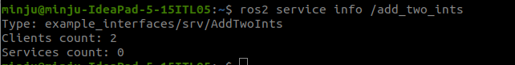

# ROS2 Jazzy 的新特性

本文档主要参照 [ROS 2 社区 Release News](https://discourse.ros.org/t/ros-2-jazzy-jalisco-released/37862)，对其中涉及到的新特性进行测试演示。

## Refs

1. [ROS 2 社区 Release News](https://discourse.ros.org/t/ros-2-jazzy-jalisco-released/37862)
2. [ROS 2 文档 Release Notes](https://docs.ros.org/en/jazzy/Releases/Release-Jazzy-Jalisco.html#new-features-in-this-ros-2-release)
3. [ROS 2 文档 ChangeLog](https://docs.ros.org/en/jazzy/Releases/Jazzy-Jalisco-Complete-Changelog.html)


## 主要更新内容

### 1. Easier Gazebo Integration

> Gazebo 是一个免费的开源机器人模拟环境，该项目与 ROS 同属 Open Robotics 运营。

#### a) 更新内容简介

为简化 ROS 2 与 Gazebo 的集成方式，从 Jazzy Jalisco 开始，对之后的每个 ROS 2 版本，社区都将提供一个推荐并受支持的 Gazebo 版本与该版本配套。对于 `Jazzy Jalisco`，推荐的 Gazebo 版本将是 `Harmonic`。

 ROS 2 Jazzy 及之后的版本仍可以使用推荐之外的 Gazebo 版本，但非推荐版本不会进行同等的测试与并入 ROS 2 中。

为了使 ROS 2 的 packages 可以更好的使用 Gazebo 的包，提供了一批 `gz_*_vendor` 包：

+ gz_common_vendor: https://github.com/gazebo-release/gz_common_vendor
+ gz_cmake_vendor: https://github.com/gazebo-release/gz_cmake_vendor
+ gz_math_vendor: https://github.com/gazebo-release/gz_math_vendor
+ gz_transport_vendor: https://github.com/gazebo-release/gz_transport_vendor
+ gz_sensor_vendor: https://github.com/gazebo-release/gz_sensor_vendor
+ gz_sim_vendor: https://github.com/gazebo-release/gz_sim_vendor
+ gz_tools_vendor: https://github.com/gazebo-release/gz_tools_vendor
+ gz_utils_vendor: https://github.com/gazebo-release/gz_utils_vendor
+ sdformat_vendor: https://github.com/gazebo-release/sdformat_vendor

具体使用中，ROS 2 的 packages 可以通过在 `package.xml` 或 `CMakeLists.txt` 中通过添加依赖使用:

```
<depend>gz_math_vendor</depend>
```

```
find_package(gz_math_vendor REQUIRED)
find_package(gz-math)

add_executable(my_executable src/exe.cpp)
target_link_libraries(my_executable gz-math::core)
```


### 2. ROS Command Line Interface Improvements

#### a) 更新内容简介
> ROS 2 更新了一系列命令行操作特性来优化使用体验。

#### b) 更新内容测试
1. 增加了 `--log-file-name` 参数，可以在运行指令时指定输出的 log 文件名。
   1. 运行 `ros2 run demo_nodes_cpp talker --ros-args --log-file-name filename`

2. 在 `TopicStatisticsOptions` 中添加了一个用户可设置的 QoS 参数，该参数允许 statistics 具有与订阅本身不同的 QoS。

3. 调用 `ros2 service info` 时会返回已连接客户端的数量.
   1. 

4. Actions 支持 ` ros2 action type <action name> ` 返回 action 类型。


### 3. ROSBag Improvements

> ROS Bag 用于模拟数据的记录，记录数据经常被用来分析和调试故障模式

#### a) 更新内容简介
1. 在之前所有的 ROS 2 版本中，ROSBag 文件都无法记录服务调用，使得用户难以理解一组服务调用如何引发特定的故障。Jazzy 直接向 ROSBag 文件中[添加了记录（log）与重放（replay）的能力](https://docs.ros.org/en/jazzy/Releases/Release-Jazzy-Jalisco.html#service-recording-and-playback)来解决这一缺陷。

   记录所有服务（services）数据：

   ```
   ros2 bag record --all-services
   ```

   记录所有服务（services）与主题（topic）数据：

   ```
   ros2 bag record --all
   ```

   从包文件中播放服务（services）数据：：

   ```
   ros2 bag play --publish-service-requests bag_path
   ```


2. Jazzy 为 ROSBag 添加了按类型选择性记录主题（topic）的能力。
   
   更多细节详见：https://github.com/ros2/rosbag2/pull/1577 以及 https://github.com/ros2/rosbag2/pull/1582
   ```
   ros2 bag record --topic_types sensor_msgs/msg/Image sensor_msgs/msg/CameraInfo
   ```
   ```
   ros2 bag record --topic_types sensor_msgs/msg/Image
   ```
   

### 4. RViz2

> RViz2 是内置的 ROS 2 可视化工具，它配备了一系列新功能，可以提高 RViz 的整体可用性并帮助过滤掉不必要的信息。简而言之，我们添加了以下功能：

#### a) 更新内容简介
> 在链接的 PR 中均存在示例图片，不再重复进行搬运，若有需求直接点入原链接查看对应效果

1. [基于正则表达式的 TF 过滤器](https://github.com/ros2/rviz/pull/1032) – 现在可以根据名称显示和隐藏变换;
2. [状态栏中的 Topic 频率](https://github.com/ros2/rviz/pull/1113) – 现在所有 Topic 都会自动以 Hz 为单位报告其频率；
3. [通过键盘重置时间](https://github.com/ros2/rviz/pull/1088) – 现在可以按“R”键重置模拟时间；
4. [可视化点云变换 point_cloud_transport](https://github.com/ros2/rviz/pull/1088) – 现在可以订阅 point_cloud_transport Topic;
5. ROS 1 的 DepthCloud, AccelStamped, TwistStamped, WrenchStamped 以及 Effort 信息类型的对等功能
6. [在 RVIZ 中支持显示相机信息 - CameraInfo](https://github.com/ros2/rviz/pull/1166)


### 5. 值得注意的其它改进

#### a) 更新内容简介

1. [ROS Perception](https://docs.ros.org/en/jazzy/Releases/Release-Jazzy-Jalisco.html#image-transport) – 对图像传输进行了大量的改进，包括：延迟订阅(lazy subscribers)、QoS 设置、运行时禁用插件的参数等等;
2. 添加了用 Python 的 [ QoS 设置自省（QoS settings introspection）](https://github.com/ros2/rosbag2/pull/1648)；
3. 向日志输出中添加了[人类可读的日期格式](https://github.com/ros2/rcutils/pull/441)；
4. 向 polygon messages 中[添加了名称](https://github.com/ros2/common_interfaces/pull/232)便于识别；
5. 添加了一个 [twist 信息插值器（message interpolator）](https://github.com/ros2/common_interfaces/pull/232)以便在 TF 中更精确的查找 twist 信息；
6. [ROS 计时器现在可以返回回调的实际时间和预期时间](https://github.com/ros2/rclcpp/pull/2343)。


## Preview: Zenoh RMW
除此之外，在本次版本发布中，社区还同步发布了一种新的 ROS 中间件 (RMW)，将 Zenoh 与 ROS 2 集成在一起。

社区在这方面取得了稳步进展，`rmw_zenoh` 现已功能齐全，但目前仍然是一个预览版，正在持续迭代之中。