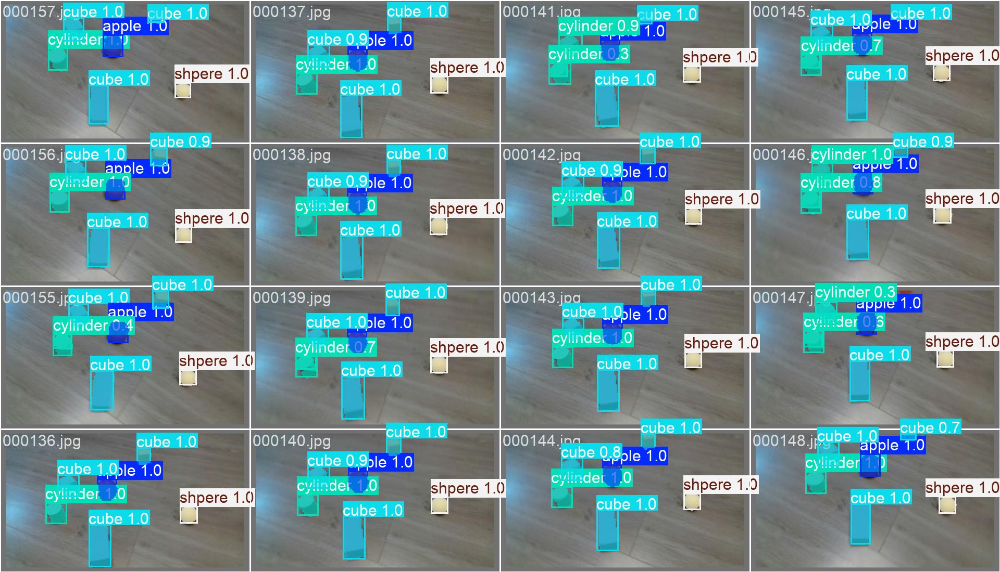

# 视觉检测

本部分旨在训练 yolov11 模型使其可以检测并分割本 Demo 中待抓取的物体。

具体效果如下：


## 环境依赖
1. 遵循 [Ultralytics](https://docs.ultralytics.com/quickstart/#install-ultralytics) 官方文档，安装`ultralytics`库。

```python
pip install ultralytics
```

## 数据准备

1. 下载准备好的数据集 [(Google Drive)](https://drive.google.com/file/d/1-MmeK4NscioGbMAXJuYQMneKJT9jJG5J/view?usp=drive_link)
2. 按以下结构组织目录并修改配置文件
```
# parent
# ├── data1016.yaml
# └── datasets
#     └── datas1016  ← 将下载好的数据解压置于此处，然后修改 `data1016.yaml` 中对应的路径
```

## 模型推理

下载预训练模型[(Google Drive)](https://drive.google.com/file/d/1GSdfZmpgIKrv5d2-QudyY58F497UirXp/view?usp=drive_link)，修改代码中模型路径，执行以下代码：

```python
from ultralytics import YOLO

# 加载预训练模型
model = YOLO("runs/segment/train/weights/last.pt")

# 推理对应的图片
results = model("color.png", imgsz=1280)

# 展示并保存推理结果
result.show()
result.save(filename="result.jpg")
```

## 模型训练

如需自行训练，执行以下代码：

```python

from ultralytics import YOLO

# Load a COCO-pretrained YOLO11n model
model = YOLO("yolo11n-seg.pt")

# Train the model on the COCO8 example dataset for 50 epochs
results = model.train(data="data1016.yaml", epochs=50, imgsz=640)

# Run inference with the YOLO11n model on the 'demo.jpg' image
# results = model("path/to/demo.jpg")

```