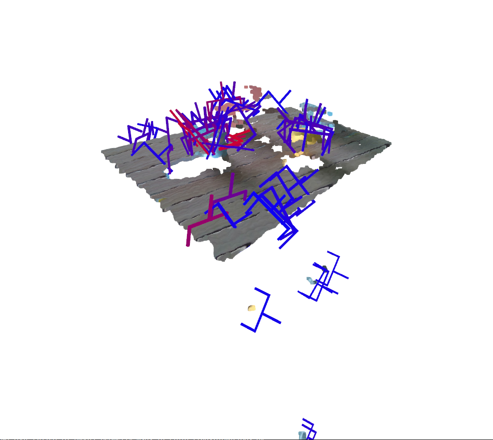
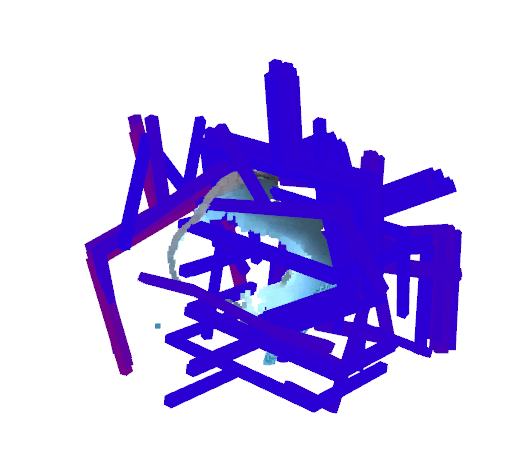

# 抓取位姿估计

本部分旨在基于 graspnet 的预训练模型生成抓取位姿。

## 采用方案说明

1. 由于抓取相关的标注复杂，且本 demo 拟抓取的物体较为简单，故直接采用 graspnet 的预训练模型生成抓取位姿；
2. 本 Demo 使用的相机为 Intel RealSense D415i，由于生成点云质量不佳（也许是缺乏相机参数的调参经验），故结合实例分割结果，将背景区域进行遮罩。

最终效果如下所示：




## 环境安装
1. graspnet：请参考【参考内容】部分的链接，进行环境的配置与安装，请根据本地 cuda 和 pytorch 的版本进行参考的选择。

## 运行 Demo

1. 将 `demo_data` 目录放在 graspnet 目录内
2. 更改 `cus_demo` 中的 `data_dir`，运行
```
python cus_demo.py --checkpoint_path logs/log_rs/checkpoint.tar
```
3. 此 demo 目前尚未更改仅为展现功能，后续待添加指定特定类别的进行分割并生成抓取位姿。


## 参考内容

本部分内容基于并参考自以下项目：
+ [graspnet-baseline](https://github.com/graspnet/graspnet-baseline)
+ [GraspNet_Pointnet2_PyTorch1.13.1](https://github.com/caiichenr/GraspNet_Pointnet2_PyTorch1.13.1)
