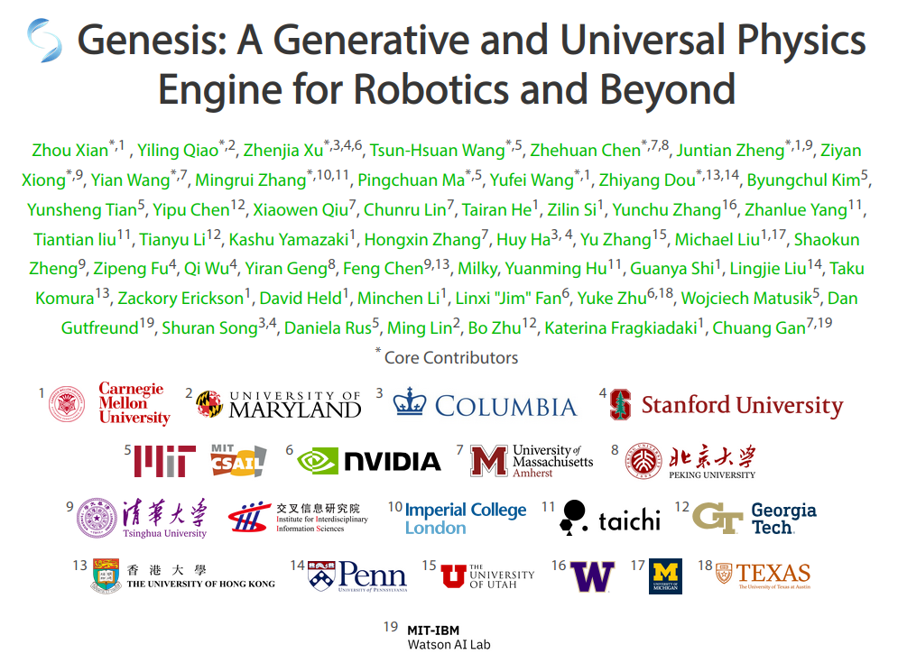
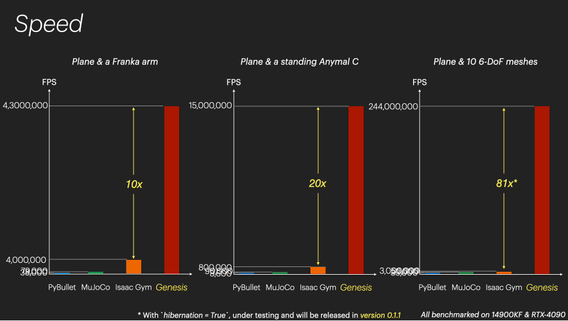
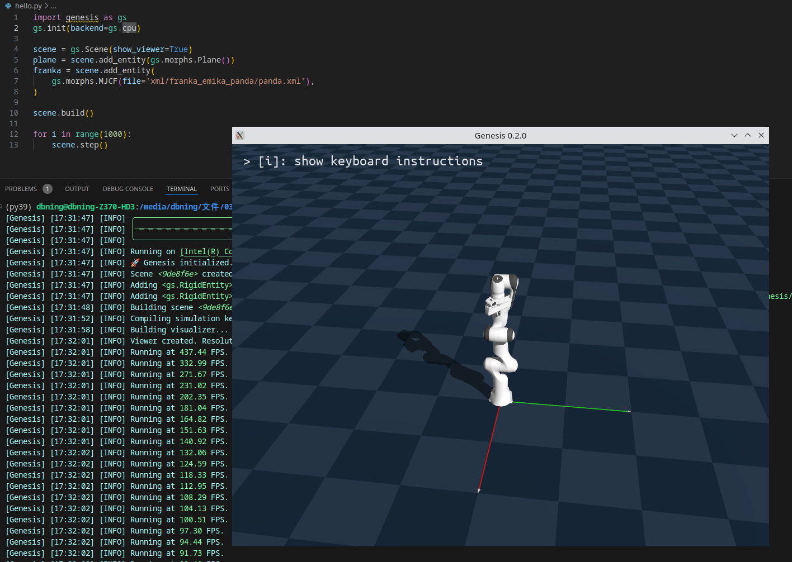
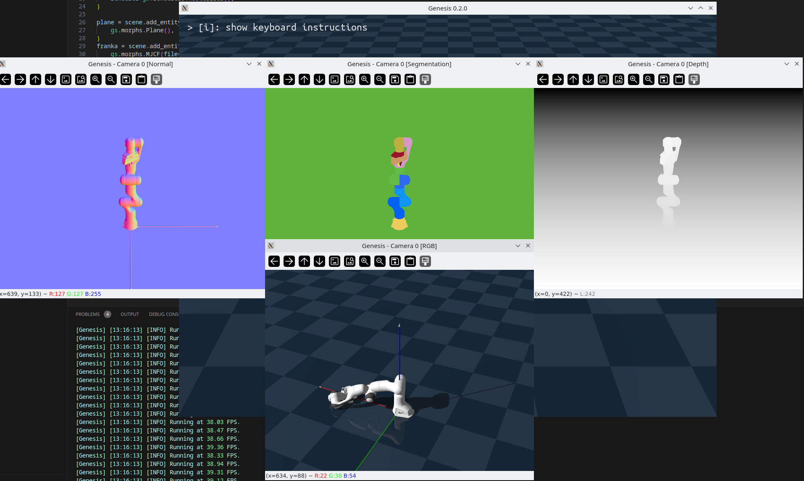

# Genesis 调研【截至12.26日】

1. genesis 是什么? 旨在解决什么问题
2. genesis 的 Roadmap
3. genesis 目前可以实现的效果
4. 现有 demo 使用情况

# 1. genesis 为什么引起这么大的轰动
1. 令人眩目的开发者阵容
	
2. 宣传的快速: 但对比方法被一些人质疑
	
3. 基于文本的生成能力: Coming Soon
4. 使用的简易性: pip 直接安装

## 2. Genesis 的目标与实际完成情况
### Genesis 的 [Mission](https://genesis-world.readthedocs.io/en/latest/user_guide/overview/mission.html)
1. Genesis 的愿景是建立一个完全透明、用户友好的生态系统，让来自物理模拟和机器人背景的贡献者聚集在一起，共同为机器人研究和其他领域创建一个高效、逼真（物理和视觉）的虚拟世界。
	2. 目前领域面对的挑战是: 现有模拟器存在可用性问题与不透明性, 基于 GPU 加速的模拟器学习曲线陡峭, 还有些闭源, 不利于领域的发展;
	3. 计算机图形学的新发展, 尤其是在模拟和渲染方面的进展,并没有被融入到模拟器中, 因此希望能够在 Genesis 中将二者结合, 为具身领域带来一个更逼真的虚拟世界;
2. 易用性与轻量化是设计的核心出发点
### Genesis 的 [Roadmap](https://genesis-world.readthedocs.io/en/latest/roadmap/index.html)
1. 物理模拟与渲染
	 - 可微分的物理基础
		- 基于物理的触觉传感器模块
		- 刚体模拟系统
	- 瓦片渲染技术
	- 优化的JIT内核编译
2. 生成框架
	1. 全面的生成系统，包含：
		- 角色运动生成
		- 相机动作控制
		- 交互场景构建
		- 面部表情动画
		- 行走策略优化
		- 操作策略设计
3. 大规模模拟
	- 支持无限范围的MPM模拟系统
4. 待开发项目
	以下是我们需要但尚未着手的功能：
	- Windows平台支持
	    - 查看器
	    - 无头渲染
	- 交互式GUI系统
	- 扩展MPM材料模型
	- 更多类型的传感器支持
## 3. Genesis 的完成情况 与 实际使用情况
> 本部分遵循官方文档提供的示例代码进行验证
> 
> 本地运行环境:
> 
> Ubuntu 22.04； 
> CPU: i7 8700K；
> GPU: GTX 1080Ti

1. Hello, Genesis
	
2. 可视化与渲染
	
3. 控制机器人
	![[genesis_3_control_robot.png]](imgs/genesis_3_control_robot.png)
4. 并行仿真
	![[genesis_4_parallel.png]](imgs/genesis_4_parallel.png)
5. 逆运动学与运动规划
	![[genesis_5_grasp.png]](imgs/genesis_5_grasp.png)
6. 非刚体模拟
	![[genesis_6_solver.png]](imgs/genesis_6_solver.png)

### 个人使用感受:
1. 我对于强化学习和机器人仿真的了解不够, 此前只使用过 Nvidia 的 Isaac Sim。在之前对仿真环境的了解过程中, 确实缺乏一个比较统一的, 开源的, 广泛使用的框架, Genesis 在未来如果可以推广并统一后续先进工作的实验环境，会大幅降低相关科研工作的复现和验证难度；
2. 项目本身更像是仿真与图形学两个方向最新工作的融合，对两方面目前的最新研究与工程现状了解不深，无法做出价值评价；
3. 目前在使用上的缺陷, 主要是没有 GUI, 在学习使用上的成本会高一点, 但是(现阶段)全部基于脚本也有好处, 在分享和复现上的门槛更低, 拥有更低上手门槛的工具总是更容易推广，还需要更多有趣的最佳实践来验证相关工具的实用性。
