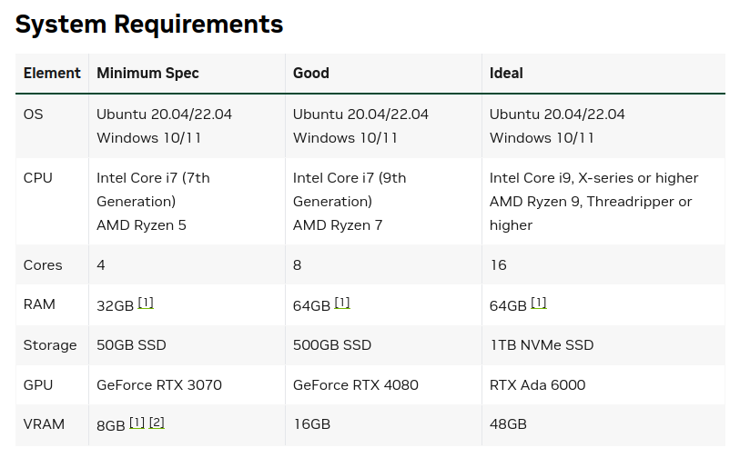
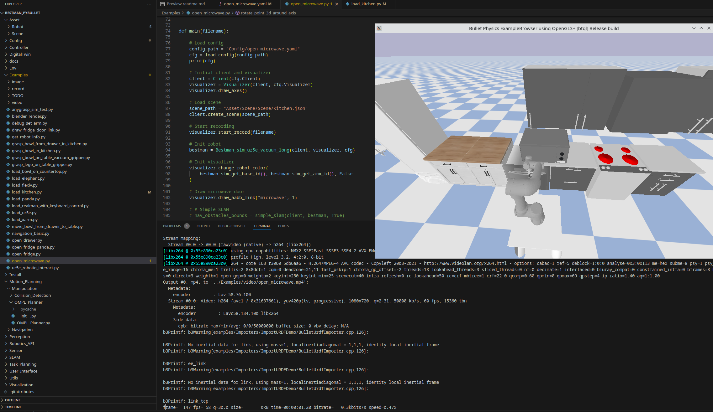

# 任务目标

> 调研并测试behavior-1k，并调研类似这样的仿真基准还有哪些？

整体来看，这样的仿真基准需要包含以下几个主要部分：
1. 仿真基于的物理仿真平台
2. 提供的场景、设备、物体模型资源
3. 提供的仿真控制交互接口
4. 针对特定任务提供具体 Demo

## 本次调研的仿真基准：

| 仿真基准                                                           | 仿真平台                                                                                               | 模型资源                                                                                                                                                                           | 控制接口                                                                                                                          | 算法或功能实现                                                                                                   | 备注                    |
| -------------------------------------------------------------- | -------------------------------------------------------------------------------------------------- | ------------------------------------------------------------------------------------------------------------------------------------------------------------------------------ | ----------------------------------------------------------------------------------------------------------------------------- | --------------------------------------------------------------------------------------------------------- | --------------------- |
| [behavior-1k](https://behavior.stanford.edu/behavior-1k)       | Isaac Sim                                                                                          | [来自 ShapeNet 和 TurboSquid 的 3D 模型](https://behavior.stanford.edu/asset-sources)，处理成 USD 格式，有约 50 个场景、 1000 个物体                                                                 | Isaac Sim 本身支持 ROS 控制；[OmniGibson Doc Controllers](https://behavior.stanford.edu/omnigibson/modules/controllers.html)也提供了一些接口 | [本基准提供超1000种行为，官方demo脚本](https://behavior.stanford.edu/omnigibson/getting_started/examples.html)          | Isaac Sim 需要的硬件设备配置较高 |
| [BestMan](https://github.com/AutonoBot-Lab/BestMan_Pybullet)   | PyBullet                                                                                           | 随项目附了一个较为简单的[厨房场景以及一些模型](https://github.com/AutonoBot-Lab/BestMan_Pybullet/tree/0.2.0/Asset)                                                                                   | 控制主要依靠PID和pybullet原生API                                                                                                       | 本基准实现了导入场景、运动控制、Anygrasp 抓取等[demo](https://github.com/AutonoBot-Lab/BestMan_Pybullet/tree/0.2.0/Examples) | BestMan 整体实现偏简陋       |
| [ManiSkill](https://github.com/haosulab/ManiSkill)             | [SAPIEN Simulator](https://sapien-sim.github.io/docs/user_guide/getting_started/installation.html) | [PartNet-Mobility Dataset](https://sapien.ucsd.edu/browse)：一个包含约2k精细建模物体的数据集；此外在基准中还整合了一些其他的[场景数据](https://maniskill.readthedocs.io/en/latest/user_guide/datasets/scenes.html) | 提供一个轻量的python运动规划库 [mplib](https://motion-planning-lib.readthedocs.io/latest/tutorials/getting_started.html)                  | 本基准主要针对GPU并行仿真提供了一些[示例](https://maniskill.readthedocs.io/en/latest/user_guide/demos/gallery.html)         |                       |
| [Habitat-Lab](https://github.com/facebookresearch/habitat-lab) | [Habitat-Sim](https://github.com/facebookresearch/habitat-sim)                                     | 整合了许多可用的[数据集](https://github.com/facebookresearch/habitat-sim/blob/main/DATASETS.md)                                                                                           | -                                                                                                                             | -                                                                                                         | 从简介目标来看主要是便捷训练agent   |


# 具体内容

> 测试设备信息
> CPU： i7-8700
> GPU： 1080Ti
> OS：Ubuntu 22.04

## Behavior-1k

Isaac Sim 的[配置需求](https://docs.isaacsim.omniverse.nvidia.com/latest/installation/requirements.html)：
至少需要有 RTX 2070+ 的配置，由于暂时没有更高性能的设备，所以本次并未使用该基准。



## BestMan

#### 安装
遵循官方[安装指引](https://github.com/AutonoBot-Lab/BestMan_Pybullet/blob/0.2.0/Install/install.md)，在 ubuntu 22.04 + py3.8 环境下安装
在安装过程中未遇见障碍

#### 使用

在安装 BestMan 的环境中，运行 `Examples` 路径下的脚本，即可运行对应的示例。主要包含一些导入场景资源、抓取、移动机器人的Demo。

相关配置主要都在示例脚本中配置，很容易修改，可以根据自己的实际情况调整。物品与场景的资产信息在主目录的 `Asset` 目录下，由于中间版本更迭，有一些示例中的路径发生变化，可以根据实际情况调整。

下图为运行 `open_microwave.py` 示例脚本的过程，在运行完成后，会有过程视频（以仿真主视角记录）存在 `Examples/video`路径下



## ManiSkill

#### 安装
SAPIEN Simulator 以及 ManiSkill 都通过 PyPI 分发，通过 pip 即可安装
安装 maniskill 后安装版本匹配的 torch 即可
```
pip install sapien

pip install --upgrade mani_skill
pip install torch torchvision torchaudio
```

#### 使用
在 [maniskill 文档](https://maniskill.readthedocs.io/en/latest/user_guide/demos/scripts.html)中，提供了脚本的编写指引与一些可使用的 demo

运行以下脚本，包含下载 "ReplicaCAD" 场景数据集，以及分别以无/有GUI的方式运行一个随机行动
```
python -m mani_skill.utils.download_asset "ReplicaCAD"
python -m mani_skill.examples.demo_random_action -e "ReplicaCAD_SceneManipulation-v1" \
  --render-mode="rgb_array" --record-dir="videos" # run headless and save video
python -m mani_skill.examples.demo_random_action -e "ReplicaCAD_SceneManipulation-v1" \
  --render-mode="human" # run with GUI
```

