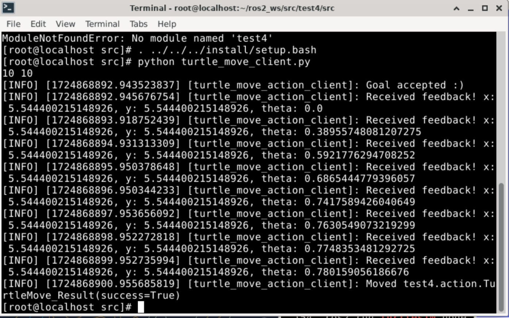
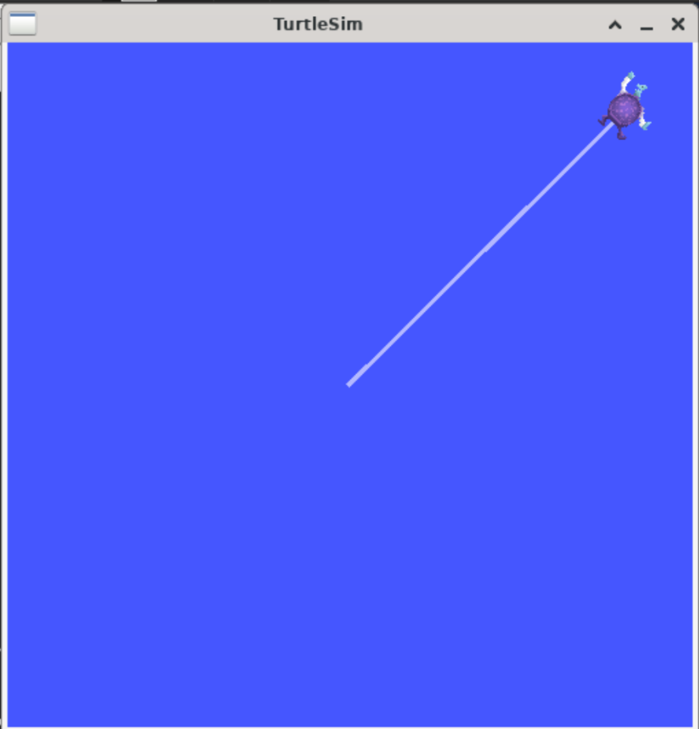

# ROS基础编程测试题目

## test 04
+ 新建功能包，自定义action通信接口让小乌龟走一条直线并反馈执行过程和结果。action的goal为start_move，feedback为小乌龟的odom信息（可以设置一定的更新频率），goal为小乌龟是否完成目标（走完自定义的一段路程）
+ 编写action的服务端和客户端程序


## 运行环境
### 软件信息
1. 宿主机OS：Arch Linux x86_64
2. 虚拟机OS：openEuler-24.03-x86 on QEMU
3. 镜像地址：https://mirror.iscas.ac.cn/openeuler/openEuler-24.03-LTS/virtual_machine_img/x86_64/


### 配置 ROS2 环境
1. 注意不能使用 `dnf` 直接安装 `python3-colcon-common-extensions`, 可使用 `pip` 安装

    ```
    sudo pip3 install -U rosdep
    sudo pip3 install -U pytest colcon-common-extensions
    ```

## 创建工作区

``` shell
mkdir -p ros2_ws/src 
cd ros2_ws/src
ros2 pkg create test4
```

## 定义 Action 接口

在 `pkg` 目录下创建 `action` 目录并创建 `TurtleMove.action` 定义相关接口信息

``` shell
cd test4
mkdir action

cd action
touch TurtleMove.action
```

```
# Request，指定小乌龟移动到的目标坐标
int32 x
int32 y
---
# Result，结果信息为小乌龟是否完成目标
bool success
---
# Feedback，返回信息为小乌龟当前的 Pose 信息
turtlesim/Pose current_pose
```

## 更改 `CMakeLists.txt` 与 `package.xml`

将需要用到的依赖库与 action 文件的相关信息加入配置文件

+ 在 `CMakeLists.txt` 中 `ament_package()` 之前加入以下内容
    ```
    find_package(turtlesim REQUIRED)
    find_package(geometry_msgs REQUIRED)
    find_package(rosidl_default_generators REQUIRED)


    rosidl_generate_interfaces(${PROJECT_NAME}
    "action/TurtleMove.action"
    DEPENDENCIES geometry_msgs turtlesim
    )
    ```

+ 在 `package.xml` 中加入以下内容：
    ```
    <buildtool_depend>rosidl_default_generators</buildtool_depend>

    <depend>action_msgs</depend>
    <depend>geometry_msgs</depend>
    <depend>turtlesim</depend>

    <member_of_group>rosidl_interface_packages</member_of_group>
    ```


## 编写服务端代码

完整代码见 `test4\src\turtle_move_server.py`, 简要实现逻辑如下：

1. 监听 `/turtle1/pose` 实时更新小乌龟当前位置；
2. 通过小乌龟当前位置 `self.current_position` 与 goal 传入的目标移动位置 `target_position` 计算位置差；
3. 通过 `/turtle1/cmd_vel` 控制小乌龟的角速度旋转至朝向目标位置方向，随后控制线速度移动至目标位置。

``` python
class TurtleMoveActionServer(Node):
    def __init__(self):
        super().__init__('turtle_move_action_server')
        self.publisher_ = self.create_publisher(Twist, '/turtle1/cmd_vel', 10)
        self._action_server = ActionServer(
            self,
            TurtleMove,
            'start_move',
            self.execute_callback
        )
        self.current_position = Pose()
        self.subsciption = self.create_subscription(
            Pose,
            '/turtle1/pose',
            self.pose_callback,
            10
        )

    async def pose_callback(self, msg):
        self.current_position.x = round(msg.x, 4)
        self.current_position.y = round(msg.y, 4) 
        self.current_position.theta = msg.theta

    async def execute_callback(self, goal_handle):
        x = goal_handle.request.x
        y = goal_handle.request.y
        feedback_msg = TurtleMove.Feedback()
        feedback_msg.current_pose = self.current_position

        target_position = Point()
        target_position.x = float(x)
        target_position.y = float(y)

        while self.distance(self.current_position, target_position) > 0.1:
            twist_cmd = self.calculate_twist(target_position)
            self.publisher_.publish(twist_cmd)
            goal_handle.publish_feedback(feedback_msg)
            time.sleep(1)

        goal_handle.succeed()

        result = TurtleMove.Result()
        result.success = True
        return result

    def distance(self, p1, p2):
        return math.sqrt((p2.x - p1.x)**2 + (p2.y - p1.y)**2)

    def calculate_twist(self, target_position):
        twist = Twist()
        dx = target_position.x - self.current_position.x
        dy = target_position.y - self.current_position.y
        distance = self.distance(self.current_position, target_position)
        angle_to_target = math.atan2(dy, dx)
        error_angle = angle_to_target - self.current_position.theta
        twist.angular.z = 0.5 * error_angle
        if abs(error_angle) < 0.01:
            twist.linear.x = 1 * distance
        return twist
```


## 编写客户端代码

完整代码见 `test4\src\turtle_move_client.py`, 主要需要实现 goal 发送与反馈接收逻辑

``` python
class TurtleMoveActionClient(Node):
    def __init__(self):
        super().__init__('turtle_move_action_client')
        self._action_client = ActionClient(
            self,
            TurtleMove,
            'start_move'
        )

    def send_goal(self, x, y):
        goal_msg = TurtleMove.Goal()
        print(x, y)

        goal_msg.x = x
        goal_msg.y = y
        self._action_client.wait_for_server()
        self._send_goal_future = self._action_client.send_goal_async(goal_msg, feedback_callback=self.feedback_callback)

        self._send_goal_future.add_done_callback(self.goal_response_callback)

    def goal_response_callback(self, future):
        goal_handle = future.result()
        if not goal_handle.accepted:
            self.get_logger().info('Goal rejected :(')
            return

        self.get_logger().info('Goal accepted :)')

        self._get_result_future = goal_handle.get_result_async()
        self._get_result_future.add_done_callback(self.get_result_callback)
    
    def get_result_callback(self, future):
        result = future.result().result
        self.get_logger().info(f'Moved {result}')
        rclpy.shutdown()
    
    def feedback_callback(self, feedback_msg):
        feedback = feedback_msg.feedback
        self.get_logger().info(f'Received feedback! x: {feedback.current_pose.x}, y: {feedback.current_pose.y}, theta: {feedback.current_pose.theta}')
```


## 运行结果展示

编译与环境激活，**在新打开的终端中都需要执行编译目录下的 `. install/setup.bash` 来激活环境**
``` shell
cd ~/ros2_ws
colcon build --packages-skip qt_gui_cpp qt_gui_core rqt_gui_cpp rqt --packages-skip-regex '^rviz.*'
. install/setup.bash
```

在三个终端分别执行 `turtlesim`、`server` 和 `client`

```shell
ros2 run turtlesim turtlesim_node

python turtle_move_server.py

python turtle_move_client.py
```

可见小乌龟从初始位置移动至 action 的指定位置，并在客户端终端看到执行过程信息





